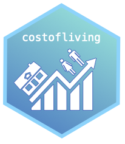

<!-- README.md is generated from README.Rmd. Please edit that file -->

```{r, include = FALSE}
knitr::opts_chunk$set(
  collapse = TRUE,
  comment = "#>",
  fig.path = "man/figures/README-",
  out.width = "100%"
)
```

# costofliving 

<!-- badges: start -->
[](https://lifecycle.r-lib.org/articles/stages.html#experimental)
[](https://CRAN.R-project.org/package=costofliving)
[](https://github.com/thuntran/costofliving/actions/workflows/R-CMD-check.yaml)
<!-- badges: end -->

## Purpose

The goal of `costofliving` is to provide functions and data sets to calculate the average cost of living for a single person earning a minimum wage salary across different states in the United States in 2022. This package contains data from the MIT Living Wage Calculator, The World Population Review, and the Missouri Economic Research and Information Center.

## Target Audience

In general, this package is for anyone interested in the breakdown of average living costs and net salaries across states in the United States. Specifically, this package targets any working individuals in the U.S. who would like to learn more about whether they find a state livable if they a earn minimum wage salary in that state. 


## Installation

You can install the development version of costofliving from [GitHub](https://github.com/) with:

``` r
# install.packages("devtools")
devtools::install_github("thuntran/costofliving")
```

## Example

Loading the `costofliving` package:

```{r load-package}
library(costofliving)
```

## Datasets Included
  + `us_cost_of_living`: A data set containing the average living costs across states in the U.S., including housing, groceries, medical care, etc. in 2022. 
  + `us_minimum_wage`: A data set containing minimum wage across states in the U.S. in 2022.
  + `us_federal_tax_rate`: A data set of the federal tax rates based on income brackets in the U.S. in 2022. 
  + `us_state_local_tax_rate`: A data set of the state and average local tax rates across states in the U.S. in 2022.

#### Example: `us_cost_of_living` data set

```{r}
us_cost_of_living
```

#### Example: `us_minimum_wage` data set

```{r}
us_minimum_wage
```

## Functions Included
  + `gross_salary`: Calculates the annual gross salary of a single person earning minimum wage at a specific state.
  + `federal_tax_owed`: Calculates the amount of federal tax owed by an individual earning minimum wage based on federal income tax brackets.
  + `state_local_tax_owed`: Calculates the amount of state and local tax owed by an individual earning minimum wage.
  + `net_salary`: Calculates the combined tax amount (federal, state, local taxes) for by an individual earning minimum wage, and obtains the net salary by deducting from the gross salary.
  + `net_salary_avg_col_difference`: Calculates the difference between the average costs of living by the net salary.
  + `avg_col_multiple_states`: Calculates the annual gross salary, total tax (federal, state, local), net salary, and difference between average cost of living and net salary of a single person earning minimum wage at one or more states.
  + `avg_col_multiple_states_plot`: Plots the difference in average cost of living and net salary of a single person earning minimum wage at one or more states.
  + `avg_col_multiple_states_plot_all`: Plots the difference in average cost of living and net salary of a single person earning minimum wage across all states in the USA.
  + `avg_col_breakdown_plot`: Plots the average cost of living for a single person at a specific state.

#### Example of Functions

`gross_salary()` is used as a helper function that calculates the annual gross salary of a single person earning minimum wage. It aids the functionality of other functions:

```{r example-1}
gross_salary("CA")
```

This is an example of how to calculate the net salary after deducting federal, state, and local taxes for a single person earning minimum wage in Texas:

```{r}
net_salary("TX")
```

This is an example of how to calculate the gross salary, total taxes, net salary, and difference between average cost of living and net salary for a single person earning minimum wage in Alabama:

```{r}
net_salary_avg_col_difference("AL")
```

This is an example of how to calculate the gross salary, total taxes, net salary, and difference between average cost of living and net salary across multiple states of a single person earning minimum wage in Massachusetts, Texas, Illinois, and Alabama:

```{r}
avg_col_multiple_states(c("MA","TX","IL","AL"))
```

This is an example of how to plot the difference in average cost of living and net salary of a single person earning minimum wage in Massachusetts, Texas, Illinois, and Alabama:

```{r}
avg_col_multiple_states_plot(c("MA","TX","IL","AL"))
```

Plotting the difference in average cost of living and net salary of a single person earning minimum wage across all states in the US:

```{r}
avg_col_multiple_states_plot_all()
```

Here is an example of how to plot the breakdown of the average costs of living for a single person earning minimum wage in Washington state:

```{r}
avg_col_breakdown_plot("WA")
```

For more ways on how to use this package and its functions and data sets, please refer to the [vignette](https://github.com/thuntran/costofliving/blob/main/README.Rmd).

# Contributors

- [Thu Tran](https://github.com/thuntran)
- [Nina Hernandez](http://github.com/nhernandez3)
- [My My Tran](http://github.com/puppehmama)


