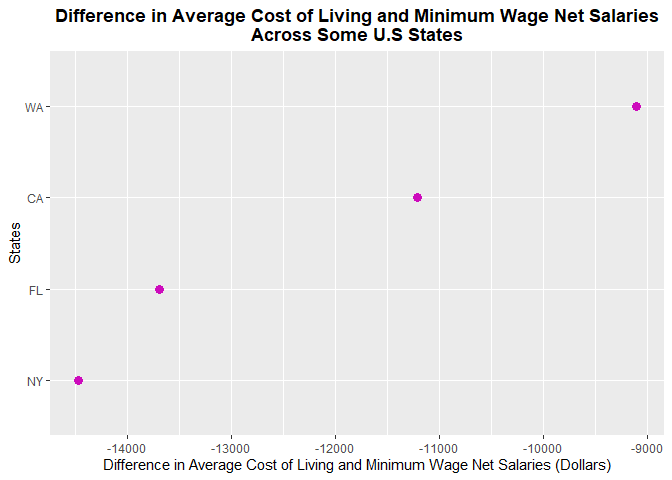
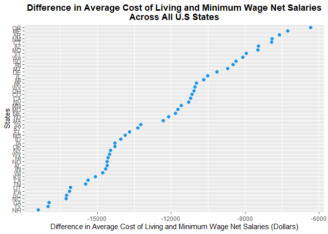
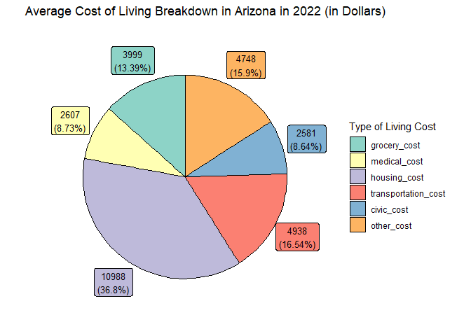

<!-- README.md is generated from README.Rmd. Please edit that file -->

# costofliving 

<!-- badges: start -->

[](https://lifecycle.r-lib.org/articles/stages.html#experimental)
[](https://CRAN.R-project.org/package=costofliving)
[](https://github.com/thuntran/costofliving/actions/workflows/R-CMD-check.yaml)
<!-- badges: end -->

## Purpose

The goal of `costofliving` is to provide functions and data sets to
calculate the average cost of living for a single person earning a
minimum wage salary across different states in the United States in
2022. This package contains data from the [MIT Living Wage
Calculator](https://livingwage.mit.edu/), [the World Population
Review](https://worldpopulationreview.com/), and [the Missouri Economic
Research and Information Center](https://meric.mo.gov/).

## Target Audience

In general, this package is for anyone interested in the breakdown of
average living costs and net salaries across states in the United
States. Specifically, this package targets any working individuals in
the U.S. who would like to learn more about whether they find a state
livable if they a earn minimum wage salary in that state.

## Installation

You can install the development version of costofliving from
[GitHub](https://github.com/) with:

``` r
# install.packages("devtools")
devtools::install_github("thuntran/costofliving")
```

Loading the `costofliving` package:

``` r
library(costofliving)
```

## Available Datasets

-   `us_cost_of_living`: A data set containing the average living costs
    across states in the U.S., including housing, groceries, medical
    care, etc. in 2022.
-   `us_minimum_wage`: A data set containing minimum wage across states
    in the U.S. in 2022.
-   `us_federal_tax_rate`: A data set of the federal tax rates based on
    income brackets in the U.S. in 2022.
-   `us_state_local_tax_rate`: A data set of the state and average local
    tax rates across states in the U.S. in 2022.

### Example: `us_cost_of_living` data set

``` r
us_cost_of_living
#> # A tibble: 50 × 9
#>    state       state_a…¹ groce…² medic…³ housi…⁴ trans…⁵ civic…⁶ other…⁷ total…⁸
#>    <chr>       <chr>       <dbl>   <dbl>   <dbl>   <dbl>   <dbl>   <dbl>   <dbl>
#>  1 Alabama     AL           3351    2733    8096    5509    2503    4508   26700
#>  2 Alaska      AK           3999    2382   11162    4938    2581    4748   29810
#>  3 Arizona     AZ           3999    2607   10988    4938    2581    4748   29861
#>  4 Arkansas    AR           3351    2521    7402    5509    2503    4508   25794
#>  5 California  CA           3999    2288   17651    4938    2581    4748   36205
#>  6 Colorado    CO           3999    2729   13357    4938    2581    4748   32352
#>  7 Connecticut CT           3891    2798   12498    4244    3207    5275   31913
#>  8 Delaware    DE           3351    2863   10845    5509    2503    4508   29579
#>  9 Florida     FL           3351    2871   11991    5509    2503    4508   30733
#> 10 Georgia     GA           3351    2583   10882    5509    2503    4508   29336
#> # … with 40 more rows, and abbreviated variable names ¹​state_abbr,
#> #   ²​grocery_cost, ³​medical_cost, ⁴​housing_cost, ⁵​transportation_cost,
#> #   ⁶​civic_cost, ⁷​other_cost, ⁸​total_avg_cost
```

### Example: `us_minimum_wage` data set

``` r
us_minimum_wage
#> # A tibble: 50 × 3
#>    state       state_abbr minimum_wage
#>    <chr>       <chr>             <dbl>
#>  1 Alabama     AL                 7.25
#>  2 Alaska      AK                10.3 
#>  3 Arizona     AZ                12.8 
#>  4 Arkansas    AR                11   
#>  5 California  CA                15   
#>  6 Colorado    CO                12.6 
#>  7 Connecticut CT                14   
#>  8 Delaware    DE                10.5 
#>  9 Florida     FL                10   
#> 10 Georgia     GA                 7.25
#> # … with 40 more rows
```

## Available Functions

-   `gross_salary()`: Calculates the annual gross salary of a single
    person earning minimum wage at a specific state.
-   `federal_tax_owed()`: Calculates the amount of federal tax owed by
    an individual earning minimum wage based on federal income tax
    brackets.
-   `state_local_tax_owed()`: Calculates the amount of state and local
    tax owed by an individual earning minimum wage.
-   `net_salary()`: Calculates the combined tax amount (federal, state,
    local taxes) for by an individual earning minimum wage, and obtains
    the net salary by deducting from the gross salary.
-   `net_salary_avg_col_difference()`: Calculates the difference between
    the average costs of living by the net salary.
-   `avg_col_multiple_states()`: Calculates the annual gross salary,
    total tax (federal, state, local), net salary, and difference
    between average cost of living and net salary of a single person
    earning minimum wage at one or more states.
-   `avg_col_multiple_states_plot()`: Plots the difference in average
    cost of living and net salary of a single person earning minimum
    wage at one or more states.
-   `avg_col_multiple_states_plot_all()`: Plots the difference in
    average cost of living and net salary of a single person earning
    minimum wage across all states in the USA.
-   `avg_col_breakdown_plot()`: Plots the average cost of living for a
    single person at a specific state.

### Examples of Function Usage

``` r
gross_salary("CA")
#> # A tibble: 1 × 4
#>   state      state_abbr minimum_wage gross_salary
#>   <chr>      <chr>             <dbl>        <dbl>
#> 1 California CA                   15        31200
```

``` r
net_salary("TX")
#> # A tibble: 1 × 8
#>   state state_abbr minimum_wage gross_salary federal_t…¹ state…² total…³ net_s…⁴
#>   <chr> <chr>             <dbl>        <dbl>       <dbl>   <dbl>   <dbl>   <dbl>
#> 1 Texas TX                 7.25        15080       1604.   1235.   2839.  12241.
#> # … with abbreviated variable names ¹​federal_tax_owed, ²​state_local_tax_owed,
#> #   ³​total_tax_owed, ⁴​net_salary
```

``` r
net_salary_avg_col_difference("AL")
#> # A tibble: 1 × 9
#>   state   state_abbr minimum_w…¹ gross…² feder…³ state…⁴ total…⁵ net_s…⁶ net_s…⁷
#>   <chr>   <chr>            <dbl>   <dbl>   <dbl>   <dbl>   <dbl>   <dbl>   <dbl>
#> 1 Alabama AL                7.25   15080   1604.   1378.   2982.  12098. -14602.
#> # … with abbreviated variable names ¹​minimum_wage, ²​gross_salary,
#> #   ³​federal_tax_owed, ⁴​state_local_tax_owed, ⁵​total_tax_owed, ⁶​net_salary,
#> #   ⁷​net_salary_avg_col_difference
```

``` r
avg_col_multiple_states(c("MA","TX","IL","AL"))
#> # A tibble: 4 × 9
#>   state         state_…¹ minim…² gross…³ feder…⁴ state…⁵ total…⁶ net_s…⁷ net_s…⁸
#>   <chr>         <chr>      <dbl>   <dbl>   <dbl>   <dbl>   <dbl>   <dbl>   <dbl>
#> 1 Massachusetts MA         14.2    29640   3351.   1852.   5204.  24436. -12333.
#> 2 Texas         TX          7.25   15080   1604.   1235.   2839.  12241. -17002.
#> 3 Illinois      IL         12      24960   2790.   2182.   4971.  19989. -10528.
#> 4 Alabama       AL          7.25   15080   1604.   1378.   2982.  12098. -14602.
#> # … with abbreviated variable names ¹​state_abbr, ²​minimum_wage, ³​gross_salary,
#> #   ⁴​federal_tax_owed, ⁵​state_local_tax_owed, ⁶​total_tax_owed, ⁷​net_salary,
#> #   ⁸​net_salary_avg_col_difference
```

``` r
avg_col_multiple_states_plot(c("CA","FL","WA","NY"))
```



``` r
avg_col_multiple_states_plot_all()
```



``` r
avg_col_breakdown_plot("AZ")
```



For more details on how to use the functions and data sets in this
package, please refer to the
[vignette](https://github.com/thuntran/costofliving/blob/main/vignettes/costofliving.Rmd).

# Contributors

-   [Thu Tran](https://github.com/thuntran)
-   [Nina Hernandez](http://github.com/nhernandez3)
-   [My My Tran](http://github.com/puppehmama)
