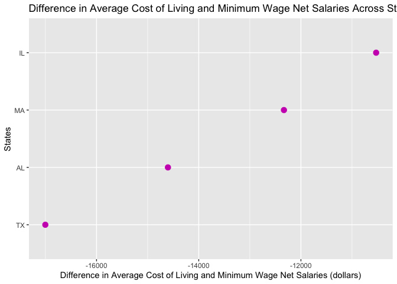
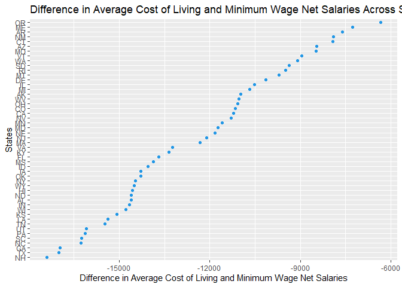

<!-- README.md is generated from README.Rmd. Please edit that file -->

# costofliving

<!-- badges: start -->

[](https://lifecycle.r-lib.org/articles/stages.html#experimental)
[](https://CRAN.R-project.org/package=costofliving)
[](https://github.com/thuntran/costofliving/actions/workflows/R-CMD-check.yaml)
<!-- badges: end -->

## Purpose

The goal of `costofliving` is to provide functions and data sets to
calculate the average cost of living for a single person earning a
minimum wage salary across different states in the United States in
2022. This package contains data from the MIT Living Wage Calculator,
The World Population Review, and the Missouri Economic Research and
Information Center.

## Target Audience

This package targets any working individuals in the US who would like to
learn more about whether they find a state livable if they earn minimum
wage in that state.

## Installation

You can install the development version of costofliving from
[GitHub](https://github.com/) with:

``` r
# install.packages("devtools")
devtools::install_github("thuntran/costofliving")
```

## Example

Loading the `costofliving` package:

``` r
library(costofliving)
```

Loading the `us_cost_of_living` data set:

``` r
us_cost_of_living
#> # A tibble: 50 × 9
#>    state       state_a…¹ groce…² medic…³ housi…⁴ trans…⁵ civic…⁶ other…⁷ total…⁸
#>    <chr>       <chr>       <dbl>   <dbl>   <dbl>   <dbl>   <dbl>   <dbl>   <dbl>
#>  1 Alabama     AL           3351    2733    8096    5509    2503    4508   26700
#>  2 Alaska      AK           3999    2382   11162    4938    2581    4748   29810
#>  3 Arizona     AZ           3999    2607   10988    4938    2581    4748   29861
#>  4 Arkansas    AR           3351    2521    7402    5509    2503    4508   25794
#>  5 California  CA           3999    2288   17651    4938    2581    4748   36205
#>  6 Colorado    CO           3999    2729   13357    4938    2581    4748   32352
#>  7 Connecticut CT           3891    2798   12498    4244    3207    5275   31913
#>  8 Delaware    DE           3351    2863   10845    5509    2503    4508   29579
#>  9 Florida     FL           3351    2871   11991    5509    2503    4508   30733
#> 10 Georgia     GA           3351    2583   10882    5509    2503    4508   29336
#> # … with 40 more rows, and abbreviated variable names ¹​state_abbr,
#> #   ²​grocery_cost, ³​medical_cost, ⁴​housing_cost, ⁵​transportation_cost,
#> #   ⁶​civic_cost, ⁷​other_cost, ⁸​total_avg_cost
```

Loading the `us_minimum_wage` data set:

``` r
us_minimum_wage
#> # A tibble: 50 × 3
#>    state       state_abbr minimum_wage
#>    <chr>       <chr>             <dbl>
#>  1 Alabama     AL                 7.25
#>  2 Alaska      AK                10.3 
#>  3 Arizona     AZ                12.8 
#>  4 Arkansas    AR                11   
#>  5 California  CA                15   
#>  6 Colorado    CO                12.6 
#>  7 Connecticut CT                14   
#>  8 Delaware    DE                10.5 
#>  9 Florida     FL                10   
#> 10 Georgia     GA                 7.25
#> # … with 40 more rows
```

Loading the `us_federal_tax_rate` data set:

``` r
us_federal_tax_rate
#> # A tibble: 7 × 4
#>   fed_tax_rate min_income max_income fed_tax_info                               
#>          <dbl>      <dbl>      <dbl> <chr>                                      
#> 1           10          0    1.03e 4 10% of taxable income                      
#> 2           12      10276    4.18e 4 1027.50 plus 12% of the amount over 10275  
#> 3           22      41776    8.91e 4 4807.50 plus 22% of the amount over 41775  
#> 4           24      89076    1.70e 5 15213.50 plus 24% of the amount over 89075 
#> 5           32     170051    2.16e 5 34647.50 plus 32% of the amount over 170050
#> 6           35     215951    5.40e 5 49335.50 plus 35% of the amount over 215950
#> 7           37     539901    1   e13 162718 plus 37% of the amount over 539900
```

Loading the `us_state_local_tax_rate` data set:

``` r
us_state_local_tax_rate
#> # A tibble: 50 × 5
#>    state       state_abbr state_tax_rate avg_local_tax_rate combined_tax_rate
#>    <chr>       <chr>               <dbl>              <dbl>             <dbl>
#>  1 Alabama     AL                   4                  5.14              9.14
#>  2 Alaska      AK                   0                  1.43              1.43
#>  3 Arizona     AZ                   5.6                2.77              8.37
#>  4 Arkansas    AR                   6.5                2.93              9.43
#>  5 California  CA                   7.25               1.31              8.56
#>  6 Colorado    CO                   2.9                4.73              7.63
#>  7 Connecticut CT                   6.35               0                 6.35
#>  8 Delaware    DE                   0                  0                 0   
#>  9 Florida     FL                   6                  1.05              7.05
#> 10 Georgia     GA                   4                  3.29              7.29
#> # … with 40 more rows
```

`gross_salary()` is used as a helper function that calculates the annual
gross salary of a single person earning minimum wage. It the
functionality of other functions:

``` r
gross_salary("CA")
#> # A tibble: 1 × 4
#>   state      state_abbr minimum_wage gross_salary
#>   <chr>      <chr>             <dbl>        <dbl>
#> 1 California CA                   15        31200
```

This is an example of how to calculate the amount of federal tax owed by
a single person earning minimum wage in a specific state:

``` r
federal_tax_owed("TN")
#> # A tibble: 1 × 5
#>   state     state_abbr minimum_wage gross_salary federal_tax_owed
#>   <chr>     <chr>             <dbl>        <dbl>            <dbl>
#> 1 Tennessee TN                 7.25        15080            1604.
```

This is an example of how to calculate the amount of state and local tax
owed by a single person earning minimum wage in a specific state:

``` r
state_local_tax_owed("MS")
#> # A tibble: 1 × 5
#>   state       state_abbr minimum_wage gross_salary state_local_tax_owed
#>   <chr>       <chr>             <dbl>        <dbl>                <dbl>
#> 1 Mississippi MS                 7.25        15080                1066.
```

This is an example of how to calculate the total tax owed and the net
salary after tax deductions by a single person earning minimum wage in a
specific state:

``` r
net_salary("TX")
#> # A tibble: 1 × 8
#>   state state_abbr minimum_wage gross_salary federal_t…¹ state…² total…³ net_s…⁴
#>   <chr> <chr>             <dbl>        <dbl>       <dbl>   <dbl>   <dbl>   <dbl>
#> 1 Texas TX                 7.25        15080       1604.   1235.   2839.  12241.
#> # … with abbreviated variable names ¹​federal_tax_owed, ²​state_local_tax_owed,
#> #   ³​total_tax_owed, ⁴​net_salary
```

This is an example of how to calculate the difference between average
cost of living and net salary for a single person earning minimum wage
in a specific state:

``` r
net_salary_avg_col_difference("AL")
#> # A tibble: 1 × 9
#>   state   state_abbr minimum_w…¹ gross…² feder…³ state…⁴ total…⁵ net_s…⁶ net_s…⁷
#>   <chr>   <chr>            <dbl>   <dbl>   <dbl>   <dbl>   <dbl>   <dbl>   <dbl>
#> 1 Alabama AL                7.25   15080   1604.   1378.   2982.  12098. -14602.
#> # … with abbreviated variable names ¹​minimum_wage, ²​gross_salary,
#> #   ³​federal_tax_owed, ⁴​state_local_tax_owed, ⁵​total_tax_owed, ⁶​net_salary,
#> #   ⁷​net_salary_avg_col_difference
```

This is an example of how to calculate gross salary, tax, net salary,
and difference between average cost of living and net salary across
multiple states of a single person earning minimum wage in a specific
state/a few different states:

``` r
avg_col_multiple_states(c("MA","TX","IL","AL"))
#> # A tibble: 4 × 9
#>   state         state_…¹ minim…² gross…³ feder…⁴ state…⁵ total…⁶ net_s…⁷ net_s…⁸
#>   <chr>         <chr>      <dbl>   <dbl>   <dbl>   <dbl>   <dbl>   <dbl>   <dbl>
#> 1 Massachusetts MA         14.2    29640   3351.   1852.   5204.  24436. -12333.
#> 2 Texas         TX          7.25   15080   1604.   1235.   2839.  12241. -17002.
#> 3 Illinois      IL         12      24960   2790.   2182.   4971.  19989. -10528.
#> 4 Alabama       AL          7.25   15080   1604.   1378.   2982.  12098. -14602.
#> # … with abbreviated variable names ¹​state_abbr, ²​minimum_wage, ³​gross_salary,
#> #   ⁴​federal_tax_owed, ⁵​state_local_tax_owed, ⁶​total_tax_owed, ⁷​net_salary,
#> #   ⁸​net_salary_avg_col_difference
```

This is an example of how to plot the difference in average cost of
living and net salary of a single person earning minimum wage in one or
multiple states in the USA:

``` r
avg_col_multiple_states_plot(c("MA","TX","IL","AL"))
```



Plotting the difference in average cost of living and net salary of a
single person earning minimum wage across all states in the US:

``` r
avg_col_multiple_states_plot_all()
```



Here is an example of how to plot the breakdown of the average costs of
living for a single person earning minimum wage in a specific state:

``` r
avg_col_breakdown_plot("WA")
```


# Contributors

- [Thu Tran](https://github.com/thuntran)
- [Nina Hernandez](http://github.com/nhernandez3)
- [My My Tran](http://github.com/puppehmama)
